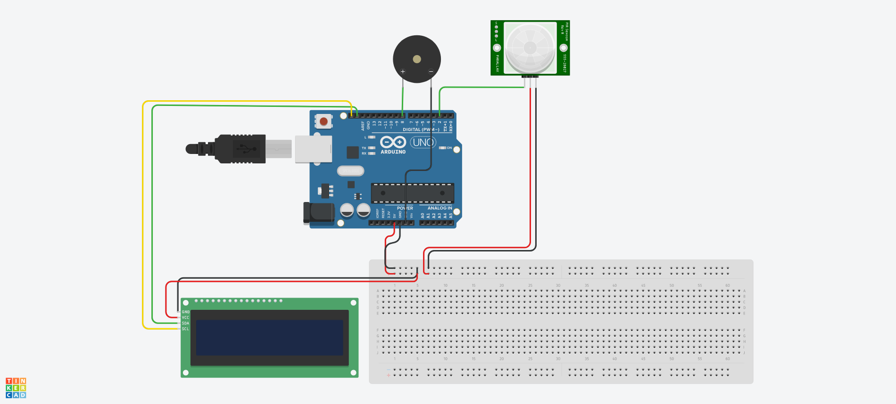
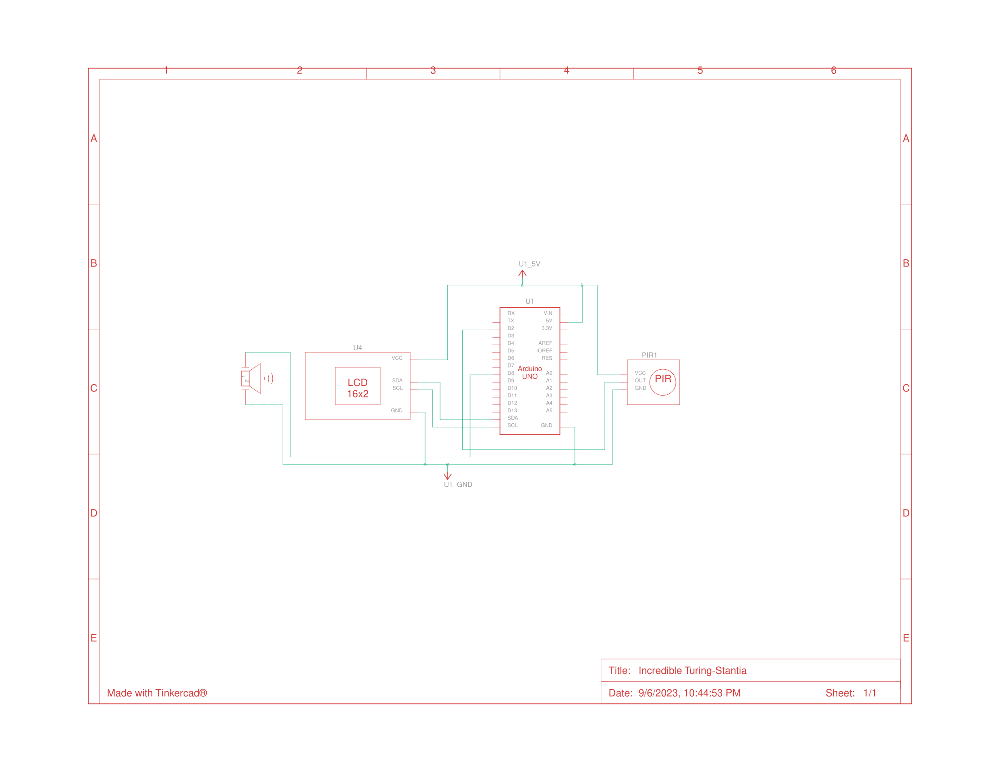

# Reloj despertador sensible al movimiento
Proyecto Arduino 1 - Internet de las cosas - 23-2: Reloj con alarma que interactua con el usuario mediante un sensor de movimiento.

## Requerimientos

Kit:
- Arduino IDE
- Arduino UNO
- LCD 16x2
- Proto Board o Breadboard
- Buzzer
- Sensor PIR
- RTC DS1302

Librerias:
- [LiquidCrystal_I2C](https://github.com/johnrickman/LiquidCrystal_I2C)
- [Rtc by Makuna](https://github.com/Makuna/Rtc)

## Diagramas
Instalación del Arduino. Vista esquemática y de circuito. No se incluye módulo RTC

### Circuito

### Esquema

## Contribuidores
- Camilo Godoy
- Constanza Moya
- Gabriel Aillapán
- Jorge Mainhard